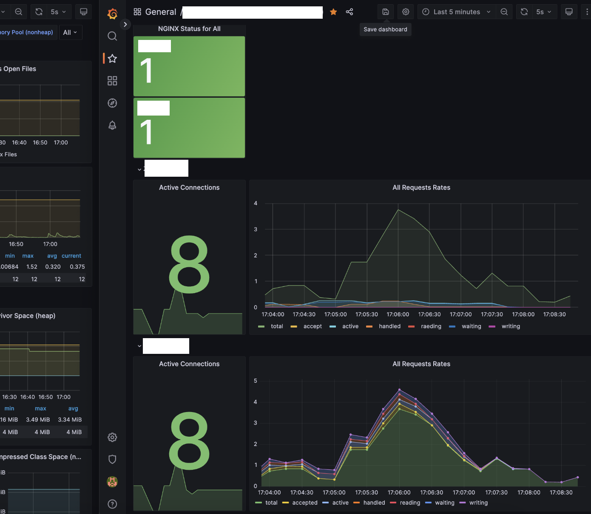

# Nginx-Prometheus-Grafana

## 목차

- [개요](#0-개요)
- [Nginx Metric 추출 활성화](#1-nginx-metric-추출-활성화)
- [Nginx Prometheus Exporter 기동](#2-nginx-promethes-exporter-기동)
- [Prometheus 설정 파일 수정](#3-prometheus-설정-파일-추가)
- [Grafana 대시보드 구성](#4-grafana-대시보드-구성)
- [최종 완성본](#5-기본적인-모니터링-대시보드-형태)

## 0. 개요

- Nginx Prometheus Exporter를 이용한 Grafana 모니터링 구축기
- 본 내용은 Nginx 웹서버를 기동 중이며, Prometheus & Grafana 연동이 이미 되어있는 것을 가정으로 설명합니다.

<br/>

## 1. Nginx Metric 추출 활성화

1. Nginx 설정 파일 열기
    ```bash
    # 아래 두 내용 중, nginx.conf 과 같이 Nginx 설정 파일에 해당되는 내용을 수정
    $ sudo vi /etc/nginx/sites-enabled/{$WEB_SERVICE_NAME}
    $ sudo vi /etc/nginx/nginx.conf
    ```

2. 아래 내용 추가
    ```text
    server {
            ...

            location /stub_status {
                    stub_status on;
                    allow {허용할 IP. 동일 서버라면 127.0.0.1 입력}; # 모든 접근을 허용할 경우 "all"로 명시
                    deny all;
            }
    }
    ```


3. 변경된 Nginx 설정 파일 적용 (Docker 이용 시에는 restart로 적용)
    ```bash
    # 1. 문법 검사
    $ sudo nginx -t

    # 2. 서비스 재실행
    $ sudo systemctl restart nginx
    ```

4. 메트릭 추출 동작 확인
    ```bash
    $ curl {Nginx 서버 주소 및 포트}/stub_status

    Active connections: 3
    server accepts handled requests
    150 150 2465
    Reading: 0 Writing: 1 Waiting: 2
    ```

<br/>

## 2. Nginx Promethes Exporter 기동

1. 기동 쉘 스크립트 작성
    ```shell
    #!/bin/bash

    # nginx_prometheus_exporter는 컨테이너(exporter) 1개당 1개의 scrape-uri을 제공
    # 따라서 여러 웹서버를 모니터링하고 싶을 경우, 각각의 컨테이너(exporter)를 띄워야 함.
    # 기타 옵션 참고 링크 : https://github.com/nginxinc/nginx-prometheus-exporter?tab=readme-ov-file#command-line-arguments

    WEB_SERVER_NAME={INPUT_YOUR_WEB_SERVICE_NAME} 
    WEB_SERVER_URI={INPUT_YOUR_WEB_SERVICE_URL}
    EXPORTER_PORT={INPUT_PORT}
    EXPORTER_NAME=nginx-prometheus-exporter_$WEB_SERVER_NAME

    # 이미 아래 이름으로 존재할 경우, 컨테이너 제거
    docker rm -f $EXPORTER_NAME

    docker run -d --rm --network bridge --name $EXPORTER_NAME \
        -p $EXPORTER_PORT:9113 \
        nginx/nginx-prometheus-exporter:latest \
        --nginx.scrape-uri=$WEB_SERVER_URI/stub_status
    ```

2. 기동 쉘 스크립트 실행
    ```bash
    $ sh dev_{$WEB_SERVICE_NAME}_nginx_exporter.sh
    $ sh stage_{$WEB_SERVICE_NAME}_nginx_exporter.sh

    ... (필요시 이하 웹서버 추가)
    ```

3. Nginx Exporter 동작 확인
    ```bash
    $ curl {Nginx 서버 주소 및 포트}/metrics

    # HELP nginx_http_requests_total Total http requests
    # TYPE nginx_http_requests_total counter
    nginx_http_requests_total 2476
    # HELP nginx_up Status of the last metric scrape
    # TYPE nginx_up gauge
    nginx_up 1

    ... (기타 등등)
    ```

<br/>

## 3. Prometheus 설정 파일 추가

   ```bash
   $ vi /{YOUR_PROMETHEUS_PATH}/prometheus/config/prometheus.yml
   
   >>>> 아래 내용 추가
   scrape_configs:
   - job_name: "nginx-prometheus"
       scrape_interval: 10s
       scrape_timeout: 10s
       metrics_path: "/metrics"
       honor_labels: false
       honor_timestamps: false
       scheme: "http"
   
       static_configs:
           # nginx_prometheus_exporter 주소여야 함.
           # 동일한 서버라면 localhost:{PORT} 입력
       - targets: ["{$NGINX_EXPORTER_SERVER URL : PORT}"]
       
           # 추후 Grafana에서 메트릭을 더 세분화하여 보기 위함.
           labels:
           instance: "01. {$WEB_SERVICE_NAME} Web서버"
           environment: "dev"
       - targets: [ "$NGINX_EXPORTER_SERVER URL : PORT" ]
           labels:
           instance: "01. {$WEB_SERVICE_NAME} Web서버"
           environment: "stage"
   <<<<<
   ```

<br/>

## 4. Grafana 대시보드 구성

- [참고한 Dashboard Json 파일](https://github.com/gurumee92/getting-started-prometheus/blob/master/src/part2/ch06/grafana/dashboard.json)
    - Nginx Plus(유료)가 아닌 무료 버전은 필수 메트릭만 제공.
- [대시보드 내의 Pannel 커스텀 시 메트릭명 참고 링크](https://github.com/nginxinc/nginx-prometheus-exporter?tab=readme-ov-file#stub-status-metrics)

<br/>

## 5. 기본적인 모니터링 대시보드 형태

상세 디테일한 포맷을 사용자별 편의대로 수정 필요

